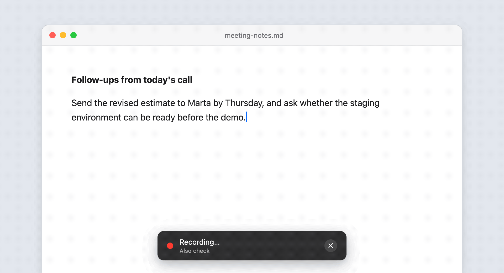
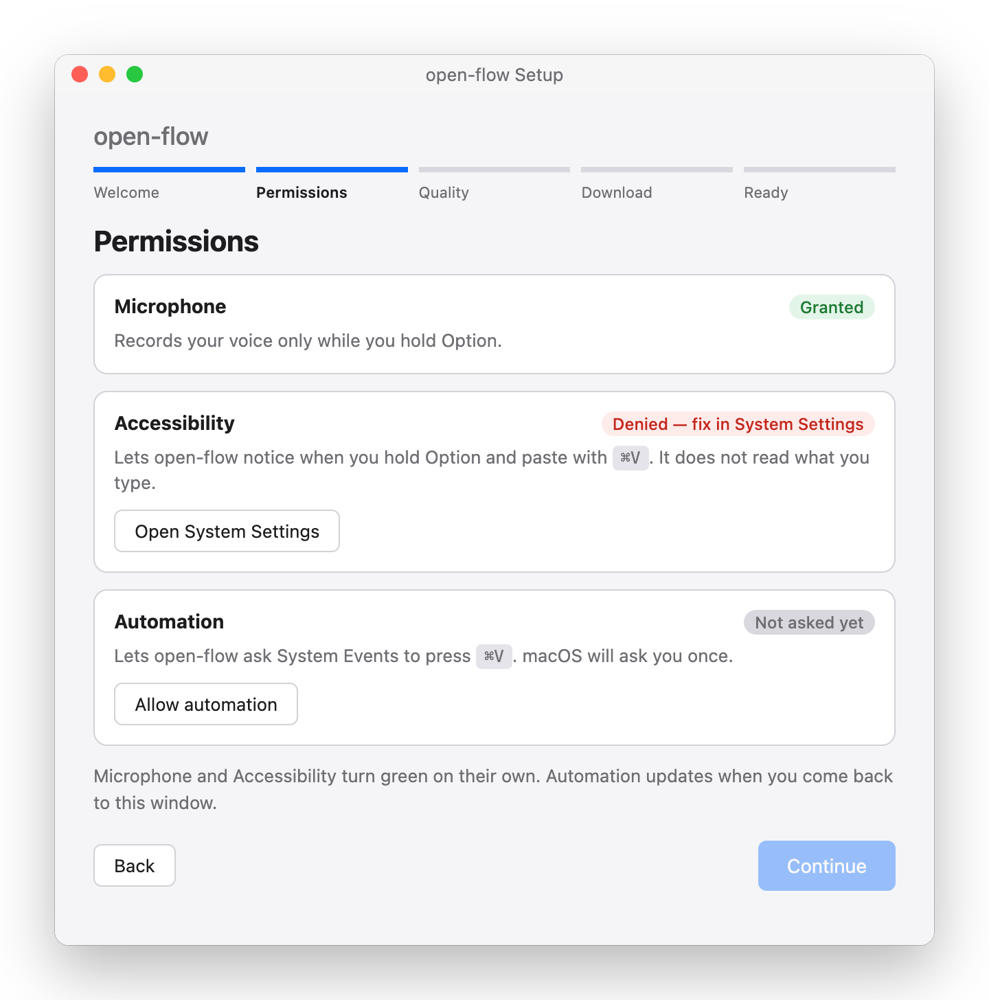
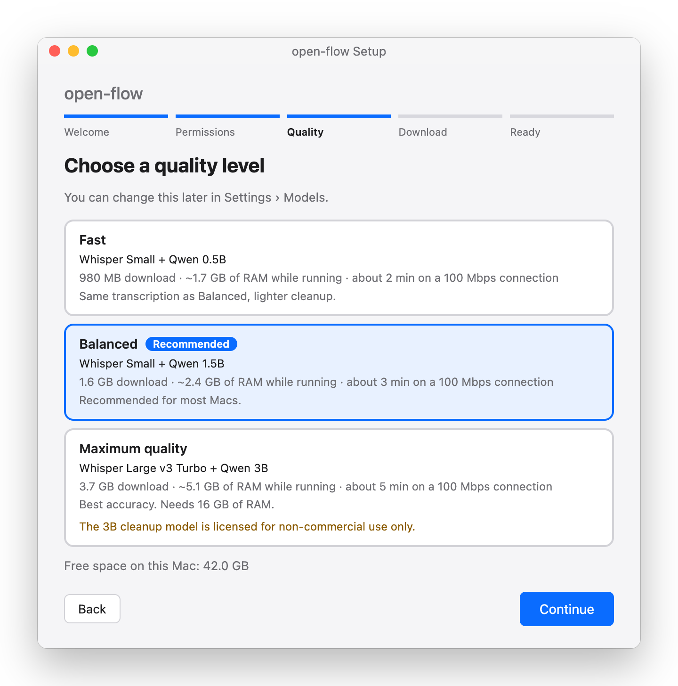
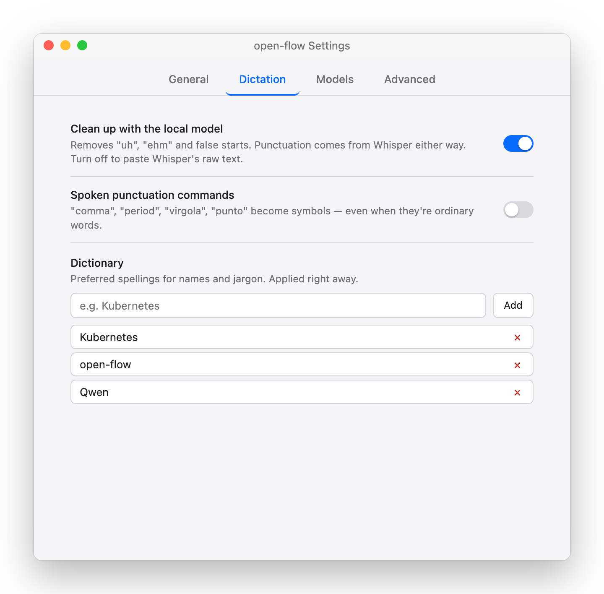
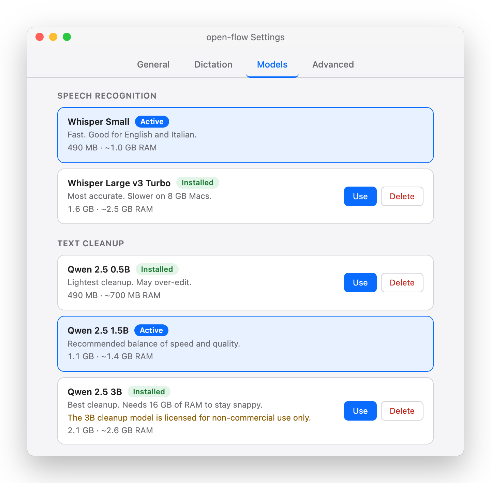
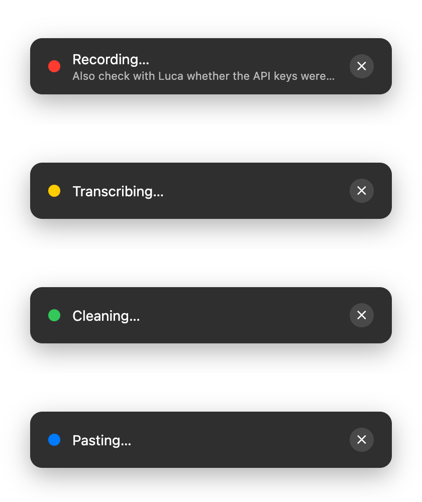
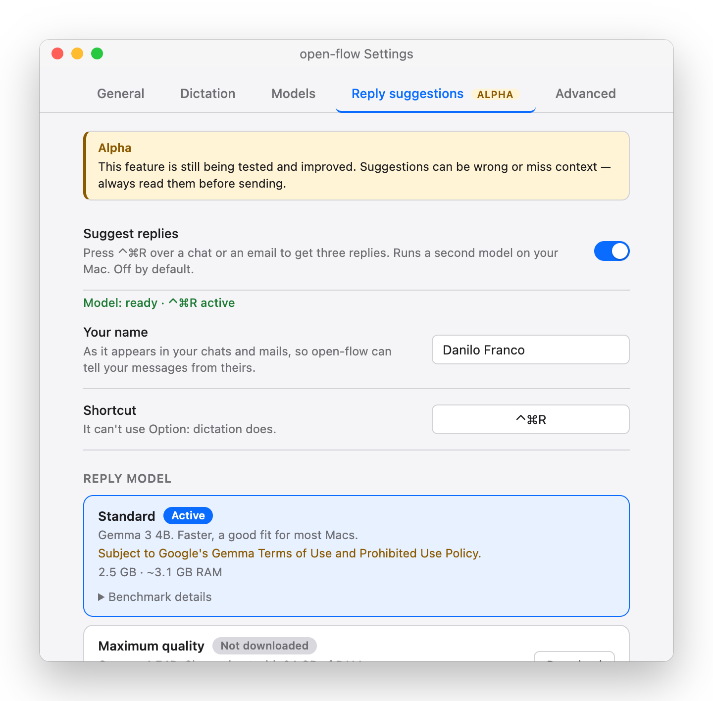
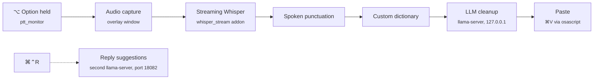

<p align="center">
  
</p>

<h1 align="center">open-flow</h1>

<p align="center">
  <b>Hold Option, speak, release.</b> Your words land in whatever text field has focus.<br>
  Fully local dictation for macOS: Whisper for speech-to-text, a small LLM to tidy the transcript, nothing leaves your Mac.
</p>

<p align="center">
  <a href="https://github.com/Fraank98/open-flow/releases/latest"></a>
  <a href="https://github.com/Fraank98/open-flow/actions/workflows/ci.yml"></a>
  <a href="LICENSE"></a>
  
  
</p>

<p align="center">
  <picture>
    <source media="(prefers-color-scheme: dark)" srcset="docs/media/flow-dark.gif">
    
  </picture>
</p>

<p align="center">
  <a href="#install">Install</a> ·
  <a href="#using-it">Using it</a> ·
  <a href="#reply-suggestions-alpha-optional-off-by-default">Reply suggestions</a> ·
  <a href="#models-and-licenses">Models</a> ·
  <a href="#troubleshooting">Troubleshooting</a> ·
  <a href="#build-from-source">Build from source</a> ·
  <a href="#how-it-works">How it works</a>
</p>

## Why open-flow

Dictation tools that feel instant usually send your voice to a server. open-flow keeps the whole pipeline on your Mac — whisper.cpp with Metal acceleration transcribes *while* you speak, a small llama.cpp model strips the "uh"s, and the text is pasted where your cursor is. No account, no cloud, no telemetry; the only network traffic is the one-time model download.

## Highlights

<table>
  <tr>
    <td width="50%" valign="top">
      <b>Push-to-talk on the Option key</b><br>
      Hold either Option key anywhere, talk, release. No window to focus, no toggle to forget. Option used as a modifier (Option+arrow, Option+letter) never triggers dictation.
    </td>
    <td width="50%" valign="top">
      <b>Streaming transcription</b><br>
      Whisper runs in-process, via a native whisper.cpp addon, as you speak — most of the work is done by the time you let go. A small overlay shows the live transcript.
    </td>
  </tr>
  <tr>
    <td valign="top">
      <b>Removal-only cleanup by a local LLM</b><br>
      A Qwen2.5 model served by llama.cpp removes "uh", "ehm", false starts and leading filler words. It is told not to touch punctuation or wording, a sanitizer rejects anything it invents, and it is skipped when there is nothing to clean. Punctuation comes from Whisper itself.
    </td>
    <td valign="top">
      <b>Spoken punctuation</b><br>
      "comma", "new paragraph", "virgola", "point d'interrogation"… become symbols, in English, Italian, Spanish, French and German. Off by default.
    </td>
  </tr>
  <tr>
    <td valign="top">
      <b>Custom dictionary and language pinning</b><br>
      Preferred spellings for names, products and jargon, applied to every transcript and fed to Whisper as a hint. Language auto-detect, or pin one of en / it / es / fr / de.
    </td>
    <td valign="top">
      <b>Stays out of the way</b><br>
      Menubar-only. Pauses Spotify / Apple Music while you dictate and resumes them afterwards. Restores your clipboard after pasting.
    </td>
  </tr>
  <tr>
    <td valign="top">
      <b>Reply suggestions (alpha, optional)</b><br>
      A shortcut reads the conversation under your mouse and proposes three replies from a second local model. Off by default — see <a href="#reply-suggestions-alpha-optional-off-by-default">Reply suggestions</a>.
    </td>
    <td valign="top">
      <b>Three quality tiers</b><br>
      From ~1 GB to ~3.7 GB of models, picked at setup. The Whisper model and the cleanup model can be changed separately in Settings › Models.
    </td>
  </tr>
</table>

## Quick start

1. **Download** `open-flow-<version>-arm64.dmg` from the [latest release](https://github.com/Fraank98/open-flow/releases/latest), drag **open-flow** to **Applications**. The build is not notarised, so the first launch needs **Open Anyway** in System Settings › Privacy & Security, or `xattr -dr com.apple.quarantine /Applications/open-flow.app` — details under [Install](#install).
2. **Run the setup.** A short wizard asks for the Microphone and Accessibility permissions (plus an Automation consent for System Events), lets you pick a quality tier and downloads the models once.
3. **Dictate.** Click into any text field, hold <kbd>⌥ Option</kbd>, speak, release.

## Screenshots

<table>
  <tr>
    <td align="center" width="50%">
      <picture>
        <source media="(prefers-color-scheme: dark)" srcset="docs/media/setup-permissions-dark.png">
        
      </picture><br>
      <sub>Setup · Permissions</sub>
    </td>
    <td align="center" width="50%">
      <picture>
        <source media="(prefers-color-scheme: dark)" srcset="docs/media/setup-quality-dark.png">
        
      </picture><br>
      <sub>Setup · Quality tier</sub>
    </td>
  </tr>
  <tr>
    <td align="center">
      <picture>
        <source media="(prefers-color-scheme: dark)" srcset="docs/media/settings-dictation-dark.png">
        
      </picture><br>
      <sub>Settings · Dictation</sub>
    </td>
    <td align="center">
      <picture>
        <source media="(prefers-color-scheme: dark)" srcset="docs/media/settings-models-dark.png">
        
      </picture><br>
      <sub>Settings · Models</sub>
    </td>
  </tr>
</table>

<p align="center">
  
  <br><sub>The overlay during a dictation</sub>
</p>

## Using it

- **Dictate:** hold either **Option** key (at least ~150 ms), speak, release. The overlay shows *Recording…* with the live transcript, then *Transcribing… → Cleaning… → Pasting…*, and the text is pasted into the focused field.
- **Cancel:** click the **✕** on the overlay, or press any other key while holding Option. A tap shorter than ~150 ms is ignored.
- **Length:** there is no fixed limit on how long you can dictate; the streaming transcript is built from the whole recording. (A separate 60-second audio window exists only for the fallback batch transcriber, used if the streaming engine fails to start.)
- **Spoken punctuation:** off by default (Settings › Dictation). With it on, *comma*, *period*, *question mark*, *new line*, *new paragraph*, *open/close quote* (and the it/es/fr/de equivalents) always become symbols — so "my period" becomes "my ." too. Without it you get the punctuation Whisper infers from your phrasing; the LLM cleanup does not change punctuation.
- **Dictionary:** Settings › Dictation. Each term is normalised in every transcript (case-insensitive) and passed to Whisper as a spelling hint. Applied right away.
- **Language:** *Auto-detect* by default (Settings › General); pin a language if detection flips on short phrases.
- **Models and cleanup:** Settings › Models switches the Whisper and cleanup models; the cleanup toggle is in Settings › Dictation. These changes need a restart — a banner offers **Restart now**. Everything else is applied immediately.
- **Menubar menu:** status line, *Pause dictation* / *Resume dictation*, *Settings…*, *Check permissions…*, *Open Logs*, *Relaunch open-flow*, *Quit open-flow*.
- **Open at login** is on by default; turn it off in Settings › General.

## Reply suggestions (alpha, optional, off by default)
> **Alpha.** This feature is still being tested and improved. Suggestions can be wrong or miss context — always read them before sending.

<p align="center">
  <picture>
    <source media="(prefers-color-scheme: dark)" srcset="docs/media/settings-reply-dark.png">
    
  </picture>
</p>

A second feature, separate from dictation: press <kbd>⌘⌃R</kbd> (<kbd>Command</kbd>+<kbd>Control</kbd>+<kbd>R</kbd>, configurable) over a chat or an email and open-flow proposes three replies.

- **How it works.** It reads the conversation under the mouse pointer through the macOS Accessibility API, checks with a local model that you are being asked something it can answer, and shows three proposals in a small pill. Press <kbd>⌘1</kbd>, <kbd>⌘2</kbd> or <kbd>⌘3</kbd> (or click a row) to paste one into the reply field. Nothing is sent for you. <kbd>Esc</kbd> closes the pill, and it closes by itself after 20 seconds.
- **Which apps.** Only the apps you list, and only the window under the mouse while its app is frontmost. Slack, Mail and Brave are listed by default; add or remove apps in Settings.
- **Privacy.** Everything stays on your Mac: the conversation is read, processed by a local model on `127.0.0.1`, and discarded. Nothing read or generated is written to disk or to the logs.
- **Turning it on.** Settings › Reply suggestions (marked Alpha). Enter the name you appear under in your chats, download a reply model (Standard, Gemma 3 4B, ~2.5 GB, or Maximum quality, Gemma 4 E4B, ~5 GB), then switch it on. While it is off no extra process runs and no extra memory is used; on, it adds a second model in RAM (about 3 GB for Standard, 6 GB for Maximum quality).
- **Caveats.** The shortcut cannot contain Option (dictation uses it). While the pill is on screen, <kbd>⌘1</kbd>/<kbd>⌘2</kbd>/<kbd>⌘3</kbd> and <kbd>Esc</kbd> do not reach the app underneath; in browsers those normally switch tabs.

## Privacy

Everything runs on your Mac. The only network traffic open-flow generates is the one-time download of the models you pick, from Hugging Face. There is no telemetry, no crash reporting, no account, no update check. Speech-to-text and cleanup talk to local processes on `127.0.0.1` only — you can confirm it in the sources: the only `fetch()` targets are `huggingface.co` and `127.0.0.1`.

Logs (`~/Library/Logs/open-flow/`) can contain transcript text; they never leave your machine and you can delete them at any time.

## Requirements

- A Mac with **Apple Silicon** (M1 or later). Intel Macs are not supported: the DMG and the engines are arm64-only.
- **macOS 11 or later.** Developed and tested on macOS 26 Tahoe.
- Disk: ~1 GB (Fast) to ~3.7 GB (Max) for models, plus the ~250 MB app.
- Memory: both models stay resident while the app runs, so budget roughly their combined size on top of the app.

## Install

1. Download `open-flow-<version>-arm64.dmg` from the [latest release](https://github.com/Fraank98/open-flow/releases/latest).
2. Open the DMG and drag **open-flow** to **Applications**.
3. **First launch — Gatekeeper.** The build is not signed with an Apple Developer ID, so macOS blocks it the first time ("Apple could not verify "open-flow" is free of malware"). Pick one:
   - **System Settings:** double-click the app once (it gets blocked), then open **System Settings → Privacy & Security**, scroll to *Security* and click **Open Anyway** next to the open-flow message, then confirm. This is the only GUI route on macOS 15 and later; on older versions **Control-click → Open → Open** also works.
   - **Terminal:** remove the quarantine flag, then launch normally:
     ```bash
     xattr -dr com.apple.quarantine /Applications/open-flow.app
     ```

   It is a one-time step per install. If you would rather not trust a downloaded binary, [build it yourself](#build-from-source).

<details>
<summary><b>First launch: what the setup wizard does</b></summary>

1. **Permissions.** Granted in macOS System Settings; the wizard re-checks when you come back to it.
   - **Microphone**, to record your voice.
   - **Accessibility**, so the app can notice the Option key and press <kbd>⌘V</kbd> to paste into the focused field.
   - **Automation** for System Events, which sends the <kbd>⌘V</kbd> keystroke. macOS asks once.

   If you grant Accessibility after the app has already started, quit and relaunch open-flow: macOS applies the grant to new processes only. open-flow tells you with a dialog.
2. **Quality tier.** Pick one of the tiers below. Later, Settings › Models lets you change the Whisper model and the cleanup model separately.
3. **Download.** The models for the chosen tier are downloaded from Hugging Face into the models folder (see [Where things live](#where-things-live)), each one verified against its SHA-256 checksum. This happens once; a failed download can be resumed or you can pick a different tier.

When it finishes, a microphone icon appears in the menubar and you can start dictating.

| Tier | Speech-to-text | Cleanup LLM | Download | Notes |
|---|---|---|---|---|
| Fast | Whisper small (488 MB) | Qwen2.5 0.5B (491 MB) | ~1.0 GB | Lightest |
| Balanced *(default)* | Whisper small (488 MB) | Qwen2.5 1.5B (1.1 GB) | ~1.6 GB | Best trade-off |
| Max | Whisper large-v3-turbo (1.6 GB) | Qwen2.5 3B (2.1 GB) | ~3.7 GB | Most accurate. **The 3B model is licensed for non-commercial use only** — see [Models](#models-and-licenses). |

</details>

## Models and licenses

All models are downloaded from Hugging Face on demand and are not bundled in the app.

| Model | License |
|---|---|
| Whisper `small`, `large-v3-turbo` (ggml, [ggerganov/whisper.cpp](https://huggingface.co/ggerganov/whisper.cpp)) | MIT |
| Qwen2.5-0.5B-Instruct, Qwen2.5-1.5B-Instruct (GGUF Q4_K_M) | Apache-2.0 |
| Qwen2.5-3B-Instruct (GGUF Q4_K_M) | [Qwen Research License](https://huggingface.co/Qwen/Qwen2.5-3B-Instruct/blob/main/LICENSE) — **non-commercial use only** |
| Gemma 3 4B instruct (GGUF Q4_K_M, [unsloth/gemma-3-4b-it-GGUF](https://huggingface.co/unsloth/gemma-3-4b-it-GGUF), used only by Reply suggestions) | [Gemma Terms of Use](https://ai.google.dev/gemma/terms) and [Prohibited Use Policy](https://ai.google.dev/gemma/prohibited_use_policy); commercial use allowed |
| Gemma 4 E4B instruct (GGUF Q4_K_M, [unsloth/gemma-4-E4B-it-GGUF](https://huggingface.co/unsloth/gemma-4-E4B-it-GGUF), used only by Reply suggestions) | [Apache-2.0](https://ai.google.dev/gemma/docs/gemma_4_license) |
| Silero VAD v6.2 (bundled, voice-activity detection) | MIT |

open-flow itself is MIT, but that does not change the models' terms. If you use open-flow for paid work, choose the Fast or Balanced tier (or disable LLM cleanup). Full notices in [THIRD_PARTY_NOTICES.md](THIRD_PARTY_NOTICES.md).

## Where things live

| What | Path |
|---|---|
| Models | `~/Library/Application Support/open-flow/models/` (override with `OPEN_FLOW_MODELS_DIR`) |
| Preferences | `~/Library/Application Support/open-flow/preferences.json` |
| Logs | `~/Library/Logs/open-flow/error.log`; `debug.log` when *Debug logging* is on (5 MB, 3 rotations) |

To uninstall: quit, delete `/Applications/open-flow.app` and the folders above, and remove open-flow from the Accessibility and Microphone lists.

## Troubleshooting

<details>
<summary><b>Holding Option does nothing</b></summary>

Check that Accessibility and Microphone are granted (System Settings → Privacy & Security, or *Check permissions…* in the menubar menu), and that the menubar menu does not say *Resume dictation* (meaning dictation was paused). If you granted Accessibility after launch, relaunch the app. While a password field has focus, macOS Secure Input can swallow the Option key release; turn on *Debug logging* (Settings › Advanced) and look for `DESYNC` in `debug.log` if you suspect it.
</details>

<details>
<summary><b>The first dictation after a long idle is slow</b></summary>

macOS throttles the app and the GPU when idle (App Nap). open-flow mitigates it with a power-save blocker and a periodic keepalive pass, but the first dictation after a long break can still be slower than the following ones.
</details>

<details>
<summary><b>The app quit and reopened by itself</b></summary>

If a Whisper pass hangs for more than 30 seconds the app relaunches itself (`whisper pass stalled` in the log). If it happens repeatedly, open an issue with the log.
</details>

<details>
<summary><b>"Paste failed — text in clipboard"</b></summary>

The ⌘V keystroke was refused or timed out. Your text is on the clipboard: paste it by hand.
</details>

<details>
<summary><b>My previous clipboard was not restored</b></summary>

If an iOS Simulator is running, reading the clipboard can time out, so open-flow cannot save the old contents to put them back.
</details>

<details>
<summary><b>Only Spotify and Apple Music are paused</b></summary>

Other players are left alone while you dictate.
</details>

<details>
<summary><b>The setup window appeared again</b></summary>

A model file for your chosen models is missing or has the wrong size, so open-flow downloads it again. Let it finish, or pick another tier.
</details>

<details>
<summary><b>Cleanup garbles short phrases</b></summary>

Small cleanup models can mangle very short or non-English input. Use the Balanced tier, pin the language, or turn LLM cleanup off in Settings › Dictation.
</details>

## Build from source

Apple Silicon, macOS 11+, Node 20+, Xcode Command Line Tools, `brew install cmake git`.

```bash
git clone https://github.com/Fraank98/open-flow.git && cd open-flow
npm run fetch-binaries      # build whisper.cpp + llama.cpp (5–15 min) — must run BEFORE npm install
npm install                 # also compiles the native addons
npm run fetch-test-models   # optional: tiny models for `npm test`
npm run lint && npm run typecheck && npm test
npm run dev                 # launch the menubar app
npm run package             # → release/open-flow-<version>-arm64.dmg
```

See [CONTRIBUTING.md](CONTRIBUTING.md) for the arm64 / Rosetta caveats.

## How it works



Main-process modules live under `src/main/`:
- `ptt-manager.ts` with the `ptt_monitor.mm` native addon — detects holding either Option key.
- `streaming-whisper-runner.ts` with the `whisper_stream.mm` addon — in-process streaming transcription ([design notes](docs/streaming-whisper-design.md)); `whisper-server.ts` is a batch fallback.
- `llm-server.ts` / `llm-cleaner.ts` — local `llama-server` cleanup pass with a removal-only output sanitizer.
- `pipeline-coordinator.ts` — orchestrates transcribe → spoken punctuation → custom dictionary → cleanup → paste.
- `text-injector.ts` — swaps the clipboard, presses ⌘V through `osascript`, then restores the clipboard.
- `reply-coordinator.ts`, `reply-classifier.ts`, `reply-generator.ts`, `reply-server-manager.ts`, `ax-context-reader.ts` — the optional reply-suggestions feature: a second `llama-server` (port 18082), started only while the feature is on.
- `setup-wizard.ts`, `preferences-window.ts`, `model-manager.ts`, `overlay-window.ts`, `menubar-app.ts` — the GUI shell and model downloads.

Release procedure: [docs/release-process.md](docs/release-process.md). The screenshots in this README are rendered from the real renderer pages by `tools/readme-media/` (see its README).

## Roadmap

Configurable hotkey · signed and notarised builds (needs an Apple Developer ID) · an Apache-licensed LLM for the Max tier · Intel support · more languages for spoken punctuation.

## Contributing

Issues and PRs welcome — see [CONTRIBUTING.md](CONTRIBUTING.md).

## License

[MIT](LICENSE) © 2026 Danilo Franco. Third-party components and model licenses: [THIRD_PARTY_NOTICES.md](THIRD_PARTY_NOTICES.md).

## Acknowledgements

- [whisper.cpp](https://github.com/ggml-org/whisper.cpp) and [llama.cpp](https://github.com/ggml-org/llama.cpp) by Georgi Gerganov and the ggml authors.
- [OpenAI Whisper](https://github.com/openai/whisper), the [Qwen](https://github.com/QwenLM/Qwen2.5) team, [Silero VAD](https://github.com/snakers4/silero-vad).
- [Electron](https://www.electronjs.org/).
- The hold-to-talk interaction is inspired by [Wispr Flow](https://wisprflow.ai). open-flow is an independent open-source project and is not affiliated with, endorsed by, or connected to Wispr in any way; "Wispr Flow" is a trademark of its owner.
